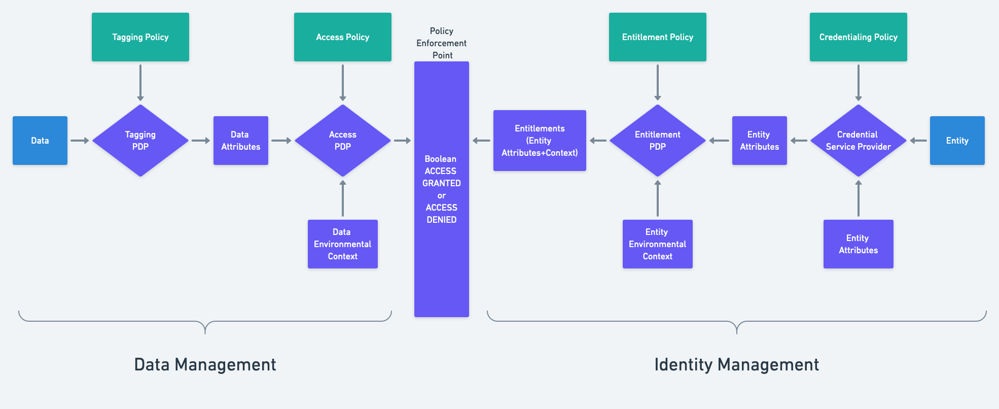

# ABAC Access Policy Decision Point

A reference implementation of an Attribute Based Access Control (ABAC) Access Policy Decision Point (PDP)

## What's an Access PDP, and how does it fit into an ABAC system?

- A Access PDP (Policy Decision Point) is a library or service that *makes Access decisions*. It is usually "wrapped" or used by an Access Policy Enforcement Point (PEP), which *enforces* whatever decision this Access PDP makes.
- This library is not an Access **PEP** - it is a domain-agnostic Access **PDP**, which domain-specific Access **PEP**s may consume. 

## Details
In this implementation, the Access PDP:

### Expects to be provided with:
  - The Data Attributes to make a decision against
  - Attribute Definitions for every Data Attribute the decision is being made against
  - A list of Entities the decision is being made against, and entitlements (Entity Attributes) for each Entity
  
as decision input.

> To the Access PDP, an "entity" is just a string identifier of any kind with entity attributes attached to it - this PDP
> doesn't care about entity subtypes (PE, NPE) or what kind of entity identifiers are being used, and "entities" have no meaning to the PDP except as a way to group decision results - they are simply there so the PEP invoking this library can correlate PDP requests with PDP results. 
  
### Returns:

For each entity identifer provided:
    1. A single, top-level boolean Access property indicating the overall access decision for that entity against the complete set of provided Data Attributes, according to the rules of the Data Attribute Definitions those map to (any-of, all-of, hierarchy).
    2. A set of DataRuleResults for each Data Attribute comparison that was done, which contributed to the top-level Access property of true or false.

### Important design decisions/constraints for this library

* **Design decision** -> Entity identifiers and "entity types" **only have meaning to the caller of the PDP**, not the PDP itself.
* **Design decision** -> This PDP _may not_ make outbound requests or consult outside sources for decision inputs - it **must be provided everything necessary to make a decision** (Entity Attributes, Data Attributes, Attribute Definitions for the Data Attributes) by its caller, usually an Access **PEP**
* **Design decision** -> The logic of this PDP must be **fixed, boolean and domain-agnostic** - deciding how to interpret and apply the decisions this Access PDP generates is the job of an Access **PEP**, which is typically domain-specific, and which would typically wrap this Access PDP.
* **Design decision** -> This PDP must be embeddable into PEPs as in-process code (library/local gRPC) or out-of-process code (separate container/remote gRPC)

## Interface

This library exposes gRPC endpoints, and so can be consumed by any code that understands the gRPC protocol. This library could be wrapped in a container and hosted out-of-process from an Access PEP, or it could be hosted in-process.
